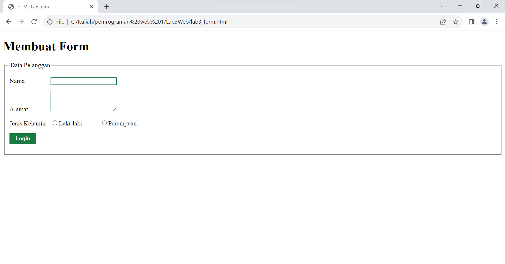

# Lab3Web

## Langkah - Langkah Praktikum

### Membuat Ordered List
Buat file baru dengan extension HTML dan buatlah code seperti gambar berikut


### Membuat Unordered List
Langkah berikutnya tambah code,setelah deklarasi ordered list pada section Unordered List pada file yang sama ikuti dengan code yang ada pada gambar berikut


### Membuat Description List
Tambahkan code untuk membuat description list setelah deklarasi unordered List


### Membuat Tabel
Buat file baru dengan nama lab3_tabel.html, Selanjutnya tambahkan code untuk membuat tabel sederhana seperti gambar berikut


### Mengatur Margin dan Padding
Untuk mengatur Margin dan Padding pada cell data, tambahkan atribut cellpadding dan cellspacing pada tag table. `<table border="1"cellpadding="6" cellspacing="0">`


### Menggabungkan Sel Data
Untuk menggabungkan sel data, gunakan atribut Rowspan dan Colspan. Atribut berfungsi untuk menggabungkan baris (secara vertikal) dan Colspan berfungsi untuk menggabungkan kolom (secara horizontal)


### Membuat Form
Buat file baru seperti gambar berikut


Selanjutnya tambahkan kode untuk membuat tabel sederhana pada file form seperti gambar berikut


### Menambahkan Style Pada Form
Supaya tampilan form lebih menarik, bisa ditambahkan CSS seperti gambar berikut




## Pertanyaan dan Tugas

1. Buatlah form yang menampilkan dropdown menu dan listbox dengan multiple selection.

 ```html
 <!DOCTYPE html>
<html>

<head>
    <title>Form Sepak Bola</title>
</head>

<body>
    <h1>Pilih Tim Sepak Bola Favorit Anda</h1>

    <form action="#" method="post">
        <label for="tim">Pilih Tim:</label>
        <select name="tim" id="tim">
            <option value="RealMadrid">Real Madrid</option>
            <option value="Barcelona">Barcelona</option>
            <option value="ManchesterUnited">Manchester United</option>
            <option value="ManchesterCity">ManchesterCity</option>
            <option value="Juventus">Juventus</option>
        </select>

        <br><br>

        <label for="timPilihan">Pilih Pemain Favorit (Multiple):</label>
        <select name="pemain[]" id="pemain" multiple>
            <option value="Ronaldo">Ronaldo</option>
            <option value="Messi">Messi</option>
            <option value="Antony">Antony</option>
            <option value="Haaland">Haaland</option>
            <option value="PaulPogba">PaulPogba</option>
        </select>

        <br><br>

        <input type="submit" value="Kirim">
    </form>
</body>

</html>
```


